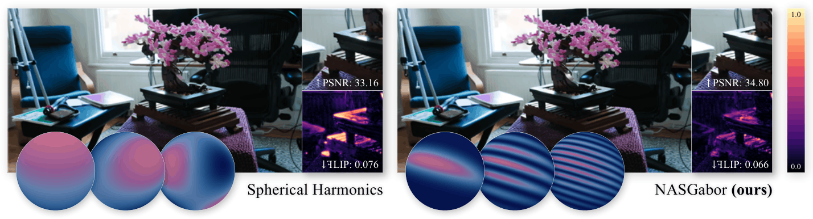

# Beyond Spherical Harmonics: Rethinking Appearance Models for Radiance Reconstruction
<!-- 
[]()
[]() -->

<span class="author-block">
  <!-- <a href="https://www.linkedin.com/in/ewa-miazga/">Ewa Miazga</a>,
</span>
<span class="author-block">
  <a href="https://arcanous98.github.io">Jorge Condor</a>,
</span>
<span class="author-block">
  <a href="https://scholar.google.com/citations?user=kH5VxAIAAAAJ&hl=en">Piotr Didyk</a>
</span> -->

[**Ewa Miazga**](https://github.com/ewaMiazga)¹²

[**Jorge Condor**](https://arcanous98.github.io)²

[**Piotr Didyk**](https://scholar.google.com/citations?user=kH5VxAIAAAAJ&hl=en)²


¹ École Polytechnique Fédérale de Lausanne (EPFL),
² Università della Svizzera Italiana (USI)

ewa.miazga@epfl.ch, jorge.condor@usi.ch, piotr.didyk@usi.ch




**Abstract:** *View-dependent appearance modeling remains a challenging problem in novel-view synthesis and reconstruction. Accurately representing complex angular effects often requires substantial memory and computational resources. For new learning-based methods, a common approach is to rely on Spherical Harmonics (SH). However, capturing high-frequency phenomena such as specular reflections demands high-order expansions, which increase memory usage and computational cost. Consequently, most methods employ low-order SH, which limits the ability to model complex view-dependent effects, resulting in overly smooth or diffuse representations. To address these limitations, we systematically evaluate a wide range of spherical functions in the context of scene reconstruction. Some of them are introduced to graphics and computer vision for the first time in this paper. Based on the insights from the experiment, we develop a novel spherical formulation, the Normalized Anisotropic Spherical Gabor function that enables efficient modeling and learning of high-frequency appearance effects while maintaining compact representation. Compared to existing approaches, our function achieves higher-quality reconstruction of view-dependent phenomena such as glints, while being up to five times more memory-efficient and more efficient to evaluate. We validate its performance in radiance-field reconstruction tasks.*

## Quickstart

This project is built on top of the [Original DBS](https://github.com/RongLiu-Leo/beta-splatting), and [gsplat](https://github.com/nerfstudio-project/gsplat) code bases. The authors are grateful to the original authors for their open-source codebase contributions.

### Installation Steps

1. **Clone the Repository:**
   ```shell
   git clone https://github.com/ewaMiazga/NASGabor
   cd NASGabor
   ```
1. **Set Up the [Conda Environment](https://docs.conda.io/projects/conda/en/latest/user-guide/getting-started.html#managing-python):**
    ```shell
    conda create -y -n nasgabor python=3.10
    conda activate nasgabor
    ```
1. **Install [Pytorch](https://pytorch.org/get-started/locally/) (Based on Your CUDA Version)**
    ```shell
    pip3 install torch torchvision torchaudio --index-url https://download.pytorch.org/whl/cu118
    ```
1. **Install Dependencies and Submodules:**
    ```shell
    cd submodules
    pip install .
    cd ..
    pip install .
    ```

### Train a Model
```shell
python train.py -s <path to COLMAP or NeRF Synthetic dataset>
```
<details>
<summary><span style="font-weight: bold;">Important Command Line Arguments for train.py</span></summary>

  #### --source_path / -s
  Path to the source directory containing a COLMAP or Synthetic NeRF data set.
  #### --cap_max
  Number of primitives that the final model produces.
  #### --model_path / -m 
  Path where the trained model should be stored.
  #### --images
  Folder with resized or original GT images.
  #### --white_background / -w
  Whether use white background.
  #### --eval
  Whether use evaluation mode.
  #### --gmm_color_mode
  Spherical Function used in Appearance model (supported: NASG - nasg, NASGabor - nasg_gabor)
  #### --lobe_number
  Light source number used in Appearance model.

</details>
<br>

- For example, simply run
   ```shell
   python train.py -s ../360_v2/bonsai -m output_bonsai --images images_2 --gmm_color_mode nasg_gabor --lobe_number 1 --cap_max 1500000 --eval
   ```

- Use automatic lr
   ```shell
   python train.py -s ../360_v2/bonsai -m output_bonsai --images images_2 --gmm_color_mode nasg_gabor --lobe_number 1 --cap_max 1500000 --eval --auto_lr
   ```

### Visualize a Model
```shell
python view.py --ply <path to a trained ply file>
```
<details>
<summary><span style="font-weight: bold;">Important Command Line Arguments for view.py</span></summary>

  #### --ply
  Path to a trained Beta Model.
  #### --port
  Port to connect to the viewer.

</details>
<br>

### Evaluate a Trained Model
```shell
python eval.py -s <path to COLMAP or NeRF Synthetic dataset> -m <path to trained model directory> 
```
<details>
<summary><span style="font-weight: bold;">Important Command Line Arguments for eval.py</span></summary>

  #### --source_path / -s
  Path to the source directory containing a COLMAP or Synthetic NeRF data set.
  #### --model_path / -m 
  Path to the trained model directory where the trained model should be stored (```output/<random>``` by default).
  #### --iteration
  Loading trained iteration for rendering. "Best" by default.
  #### --images 
  Folder with resized or original GT images. 

</details>
<br>

### Benchmark 
```shell
./benchmark.sh <datasets> <root_output>
```
<details>
<summary><span style="font-weight: bold;">Important Command Line Arguments for benchmark.sh</span></summary>

  #### ```datasets/```
  Root folder which stores MipNerf-360, Tanks and Temples and Deep Blending datasets.
  #### ```root_output/```
  Root folder which stores benchmark outputs.

</details>
<br>

## Per-scene evaluation of NASGabor with varying number of lobes across all datasets.

#### Mip-NeRF360

| Scene | PSNR↑ (1L) | SSIM↑ (1L) | LPIPS↓ (1L) | PSNR↑ (2L) | SSIM↑ (2L) | LPIPS↓ (2L) | PSNR↑ (3L) | SSIM↑ (3L) | LPIPS↓ (3L) | PSNR↑ (4L) | SSIM↑ (4L) | LPIPS↓ (4L) | PSNR↑ (5L) | SSIM↑ (5L) | LPIPS↓ (5L) |
|-----------|-----------|-----------|------------|-----------|-----------|------------|-----------|-----------|------------|-----------|-----------|------------|-----------|-----------|------------|
| bicycle   | 25.24 | 0.7795 | 0.1773 | 25.23 | 0.7809 | 0.1755 | 25.31 | 0.7822 | 0.1754 | 25.29 | 0.7822 | 0.1753 | 25.29 | 0.7823 | 0.1760 |
| bonsai    | 34.49 | 0.9554 | 0.1841 | 34.60 | 0.9560 | 0.1835 | 34.68 | 0.9564 | 0.1826 | 34.78 | 0.9566 | 0.1824 | 34.81 | 0.9566 | 0.1824 |
| counter   | 30.76 | 0.9267 | 0.1723 | 31.03 | 0.9282 | 0.1701 | 31.01 | 0.9288 | 0.1693 | 31.00 | 0.9289 | 0.1688 | 31.15 | 0.9292 | 0.1684 |
| flowers   | 21.84 | 0.6259 | 0.3060 | 21.81 | 0.6271 | 0.3045 | 21.82 | 0.6263 | 0.3067 | 21.82 | 0.6275 | 0.3047 | 21.80 | 0.6272 | 0.3056 |
| garden    | 27.43 | 0.8674 | 0.1061 | 27.50 | 0.8687 | 0.1049 | 27.46 | 0.8689 | 0.1047 | 27.47 | 0.8693 | 0.1040 | 27.51 | 0.8697 | 0.1039 |
| kitchen   | 32.82 | 0.9351 | 0.1204 | 32.98 | 0.9359 | 0.1195 | 32.92 | 0.9361 | 0.1189 | 32.98 | 0.9363 | 0.1186 | 33.00 | 0.9365 | 0.1184 |
| room      | 33.32 | 0.9375 | 0.1890 | 33.42 | 0.9378 | 0.1887 | 33.41 | 0.9371 | 0.1891 | 33.27 | 0.9355 | 0.1894 | 33.54 | 0.9379 | 0.1888 |
| stump     | 26.92 | 0.7916 | 0.1901 | 26.78 | 0.7906 | 0.1905 | 26.78 | 0.7886 | 0.1922 | 26.76 | 0.7886 | 0.1926 | 26.74 | 0.7887 | 0.1924 |
| treehill  | 22.77 | 0.6451 | 0.2921 | 22.84 | 0.6466 | 0.2917 | 22.89 | 0.6462 | 0.2908 | 22.79 | 0.6465 | 0.2921 | 22.78 | 0.6472 | 0.2939 |
| **Mean**  | **28.40** | **0.8294** | **0.1930** | **28.46** | **0.8302** | **0.1921** | **28.48** | **0.8301** | **0.1922** | **28.46** | **0.8302** | **0.1920** | **28.51** | **0.8306** | **0.1922** |

#### Tanks & Temples

| Scene | PSNR↑ (1L) | SSIM↑ (1L) | LPIPS↓ (1L) | PSNR↑ (2L) | SSIM↑ (2L) | LPIPS↓ (2L) | PSNR↑ (3L) | SSIM↑ (3L) | LPIPS↓ (3L) | PSNR↑ (4L) | SSIM↑ (4L) | LPIPS↓ (4L) | PSNR↑ (5L) | SSIM↑ (5L) | LPIPS↓ (5L) |
|-------|-----------|-----------|------------|-----------|-----------|------------|-----------|-----------|------------|-----------|-----------|------------|-----------|-----------|------------|
| train | 22.60 | 0.8329 | 0.1869 | 22.61 | 0.8357 | 0.1832 | 22.62 | 0.8332 | 0.1834 | 22.84 | 0.8357 | 0.1830 | 22.73 | 0.8350 | 0.1821 |
| truck | 26.68 | 0.9020 | 0.1058 | 26.75 | 0.9026 | 0.1058 | 26.69 | 0.9021 | 0.1064 | 26.74 | 0.9024 | 0.1057 | 26.73 | 0.9022 | 0.1059 |
| **Mean** | **24.64** | **0.8674** | **0.1463** | **24.68** | **0.8692** | **0.1445** | **24.66** | **0.8677** | **0.1449** | **24.79** | **0.8691** | **0.1444** | **24.73** | **0.8686** | **0.1440** |

#### DeepBlending

| Scene | PSNR↑ (1L) | SSIM↑ (1L) | LPIPS↓ (1L) | PSNR↑ (2L) | SSIM↑ (2L) | LPIPS↓ (2L) | PSNR↑ (3L) | SSIM↑ (3L) | LPIPS↓ (3L) | PSNR↑ (4L) | SSIM↑ (4L) | LPIPS↓ (4L) | PSNR↑ (5L) | SSIM↑ (5L) | LPIPS↓ (5L) |
|-----------|-----------|-----------|------------|-----------|-----------|------------|-----------|-----------|------------|-----------|-----------|------------|-----------|-----------|------------|
| drjohnson | 30.21 | 0.9131 | 0.2271 | 30.15 | 0.9127 | 0.2281 | 29.86 | 0.9095 | 0.2291 | 29.88 | 0.9102 | 0.2297 | 29.60 | 0.9084 | 0.2310 |
| playroom  | 29.61 | 0.9091 | 0.2373 | 30.32 | 0.9172 | 0.2291 | 30.39 | 0.9156 | 0.2330 | 30.86 | 0.9180 | 0.2299 | 30.19 | 0.9106 | 0.2319 |
| **Mean**  | **29.91** | **0.9111** | **0.2322** | **30.24** | **0.9149** | **0.2286** | **30.13** | **0.9125** | **0.2311** | **30.37** | **0.9141** | **0.2298** | **29.90** | **0.9095** | **0.2315** |

<!-- ## Spherical Functions library -->
<!-- In the paper Spherical Functions were introduced and they can be installed with 
To find more information refer to repository:
```sh
``` -->

## Citation
If you find our code or paper helps, please consider giving us a star or citing:
```bibtex
@misc{miazga2026NASGabor,
      title={Beyond Spherical Harmonics: Rethinking Appearance Models for Radiance Reconstruction}, 
      author={Ewa Miazga and Jorge Condor and Piotr Didyk},
      year={2026},
      eprint={2606.09794},
      archivePrefix={arXiv},
      primaryClass={cs.CV},
      url={https://arxiv.org/abs/2606.09794},
}
```
